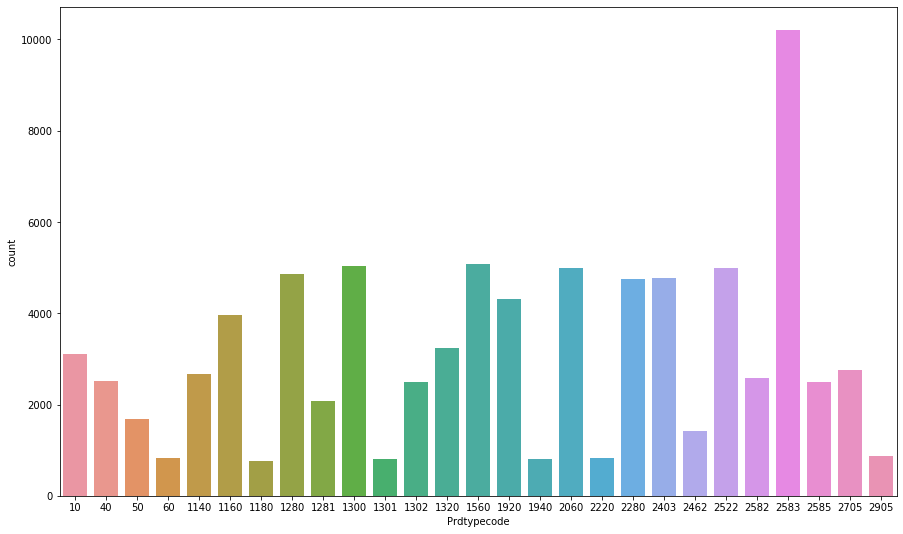

# SIGIR 2020 E-Commerce Workshop Data Challenge (Multi-modal Classification Task) 
## Task Intro

[This challenge](https://sigir-ecom.github.io/data-task.html) focuses on the topic of large-scale multi-modal (text and image) classification, where the goal is to predict each product’s type code as defined in the catalog of Rakuten France. To be specific, given a training set of products and their product type codes, predict the corresponding product type codes for an unseen held out test set of products. The systems are free to use the available textual titles and/or descriptions whenever available and additionally the images to allow for true multi-modal learning.

## Dataset 
The organizer released approximately 99K product listings in tsv format, including 84,916 samples for training, 937 samples for phase 1 testing and 8435 samples for phase 2 testing. The training dataset consists of product titles, descriptions, images and their corresponding product type codes. There are 27 product categories in the training dataset and the number of product samples in each category ranges from 764 to 10,209. The frequency distribution of categories in the training dataset is shown in the following figure.

## Reference